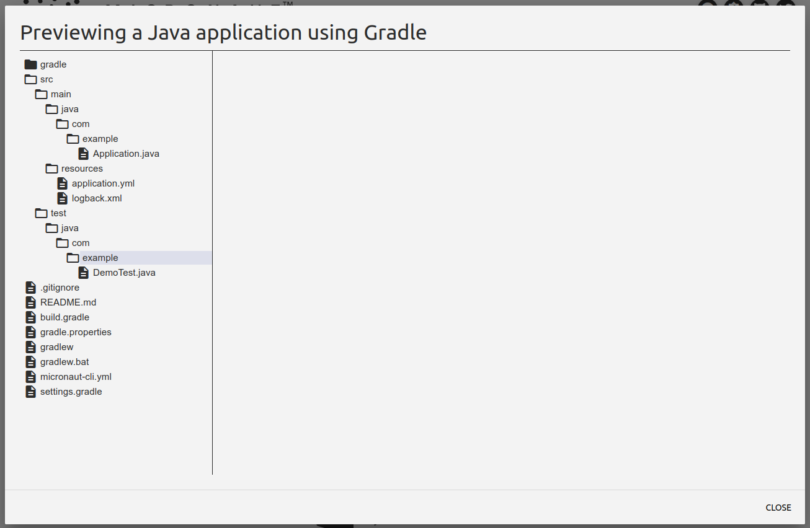

# Lab 1 - Getting setup

In this lab we'll simple generate our starter projects. We'll do this via both the launcher and the 
commandline tool.

Detailed information can be found in the [official documentation](https://micronaut-projects.github.io/micronaut-starter/latest/guide/index.html#introduction)

## Create new project with launcher

Go to to [Micronaut Launch](https://micronaut.io/launch/)

This should take you to a starter page with a number of options. For this lab we'll stick mostly to the defaults:

- For Application Type pick **Micronaut Application**
- Java version should match your installed Java version
- Chose a base package and application name of your choice. These will determine you basic package structure
- Micronaut Version should be 2.2.0
- Stick with Java for Language. Note that all features should work just fine for all three languages listed
- Build will be Gradle as a default. Solutions for both Gradle and Maven will be provided. Do note that either gradlew or
mvnw will be included in the project, so no maven or gralde install is required.
- JUnit will be sufficient for testing framework.

The four buttons will allow you to modify and preview the generated project:

- Features: This will allow you to add pre-configured dependecies. You can always add these later by hand.
- Diff: This will show you to difference between a basic Micronaut project and the changes needed to add any
features you've chosen. This can come in usefull when you want to add new features by hand and don't know which
dependencies to add later on. 
- Preview: This will launch a window that will show you the structure of the project that will be generated. You can use
this as a sanity check before creating the actual project
- Genete Project: Will create you project and offer it as either a .zip download or push it directy to github.

For this project, please do not pick any features yet. Review you project with the Preview button. This should look like:



## Create new project with mn commandline

You can download the commandline utility from the Micronaut site:
[Download](https://micronaut.io/download.html)

### Linux

If already installed on your system, it is recommended to use SDKMan. You can get sdkman by executing:
````bash
$ curl -s https://get.sdkman.io | bash
````

````
$ source "$HOME/.sdkman/bin/sdkman-init.sh"
````

````bash
$ sdk install micronaut
````

If you do not have or don't want to use SDKMan, you can download the binary from github:

[Micronaut 2.2.0](https://github.com/micronaut-projects/micronaut-starter/releases/download/v2.2.0/micronaut-cli-2.2.0.zip)

### Mac 

You can use Homebrew to install the mn binary:

````
$ brew cask install micronaut-projects/tap/micronaut
````

### Windows

If you use Chocolatey, please use:

````
$ choco install micronaut
````

Otherwise you can grab the binary from github:

[Micronaut 2.2.0](https://github.com/micronaut-projects/micronaut-starter/releases/download/v2.2.0/micronaut-cli-2.2.0.zip)

Unzip to a location of choice.

Create an environment variable called **MICRONAUT_NOME** and point it to the installation directory.
Update your **PATH** to include **%MICRONAUT_HOME%\bin**

### Create the project

To verify that the *mn* tool is correctly installed:

````bash
$ mn --version
Micronaut Version: 2.1.4
````
You should at least have version 2.1.x installed for the next labs. It is possible that brew, chocolatey
or sdkman will install a different version depending on what is available for your system. 

Note that this will influence the versions of micronaut dependencies added to your build.gradle or pom.xml file.
You should be fine when running >2.1.x for the following labs.

To create the actual project, simple execute the following command:

````bash
$ mn create-app micronaut-meetup
````

This will create a sample app with base package and name 'micronaut-meetup'.
Add the -h flag to see the more options available for the create-app command:

````bash
$ mn create-app -h
````

The *mn* tool will offer the same features as the launch site when creating a new project, with exception 
of the diff and preview features.

### Run it

You can run the generated application by executing gradlew build run from the root directory:
````bash
$ ./gradlew build run
````

If you use maven, you can use:
````
$ ./mvnw compile exec:exec
````

*You can omit the **./** when running on Windows.*
